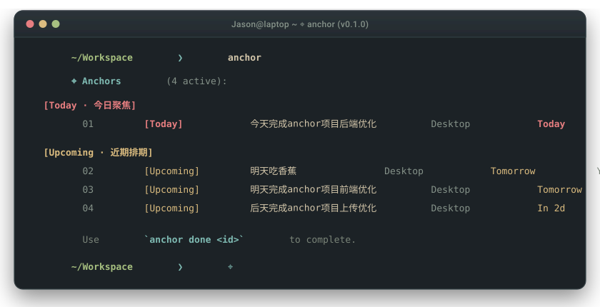

# ⌖ Anchor

<p align="center">
  <strong>面向 AI 编程智能体的零污染、零闲置 Token 跨会话任务记忆。</strong><br>
  <em>告别发霉的 TODO.md。零 Git 历史污染，0 闲置 Token 损耗，写完代码自动闭环核销。</em>
</p>

<p align="center">
  <a href="README.md">English</a> •
  <a href="#为什么需要-anchor">💡 核心痛点</a> •
  <a href="#核心机制">✨ 核心机制</a> •
  <a href="#终端交互设计">🖥️ 界面设计</a> •
  <a href="#横向技术对比">📊 竞品对比</a> •
  <a href="#快速上手">🚀 快速开始</a> •
  <a href="#测试与质量保障">🧪 质量验证</a>
</p>

<p align="center">
  <a href="https://github.com/3ZEROS12/anchor/actions/workflows/ci.yml">
    
  </a>
  
  
  
  
  
  
</p>

<p align="center">
  
</p>

---

## 为什么需要 Anchor？

使用终端编程智能体（Claude Code、Pi、Aider 等）进行实际项目开发时，开发者普遍面临三个摩擦：

1. **终端退出即失忆**：按下 `Ctrl+C` 退出终端，Agent 内存中的上下文被全部清空。未完成的代码重构计划、临时交代的排期与多步约定瞬间丢失。
2. **TODO.md 污染与 Token 泥潭**：直接在工程根目录写 `TODO.md` 或 `AGENTS.md`，不仅会产生大量 Git 杂质提交，而且**每一轮对话都要把几十行陈旧清单塞入 System Prompt**，白白消耗大量 Token 预算，并分散模型对当前核心代码的注意力。
3. **静态清单无限腐烂**：写完代码后，工程师极少会专程打开 Markdown 逐个打勾。未勾选的旧任务烂在仓库里，越积越多。

现有的解决方案大多走向了两个重型极端：
* `gastownhall/beads`：往代码仓库里硬塞一个 200MB 的 Dolt 关系型数据库来跟踪任务关系；
* `Gentleman-Programming/engram`：启动常驻后台的 Go 守护进程，搭配 SQLite 与持续向量检索，带来额外的进程驻留开销与通信延迟。

**Anchor 选择了最克制、轻量的工程路径**：任务状态统一保存在用户主目录 `~/.anchor/`，被管项目 100% 保持干净；日常工作轮次保持 0 Token 损耗，仅在 Agent 触碰关联代码文件时精准唤醒；代码提交或退出终端时自动核销归档。

---

## 核心机制

```text
┌──────────────────────────────────────────────────────────────────────────────┐
│                        Anchor 生命周期状态机                                  │
└──────────────────────────────────────┬───────────────────────────────────────┘
                                       │ 记录任务: /pin "重构鉴权为 HttpOnly Cookie"
                                       ▼
               ┌───────────────────────────────────────────────┐
               │           [活跃期 ACTIVE] (首轮注入提示)        │
               │ - 底部状态栏指示: ⌖ 4                          │
               │ - 第 2 轮起完全脱离提示词 (0 Token 稳态)        │
               └───────┬───────────────────────────────┬───────┘
                       │                               │
        Git 提交命中 /  │                               │ 闲置时间衰减
        触碰关联代码文件  ▼                               ▼
  ┌──────────────────────────────┐            ┌────────────────────────────────┐
  │   [多语言语法安全 JIT 唤醒]   │            │    [休眠期 SLEEPING] (0 Token) │
  │ 触碰代码时注入语言对应注释    │            │ 全局安全封存，不打扰当前心流，   │
  │ JSON/ENV 等格式绝对跳过      │            │ 触碰关联文件时重新唤醒          │
  └──────────────┬───────────────┘            └────────────────┬───────────────┘
                 │                                             │
        退出自动提议 / Commit 命中                             │ 静默定期清理
                 ▼                                             ▼
  ┌──────────────────────────────┐            ┌────────────────────────────────┐
  │     [已完成归档 SETTLED]      │            │     [超期淘汰 GRAVEYARD]       │
  │ 追加写入 archive.jsonl 归档   │            │ 超期自动清理，防止陈旧堆积       │
  │ 从当前活跃上下文中物理移除    │            │                                │
  └──────────────────────────────┘            └────────────────────────────────┘
```

### 1. 绝对零仓库污染与跨进程并发文件锁
Anchor 绝不在被管理的代码工程内创建 `.anchor/` 目录，也不修改本地 Git 树。所有状态统一保存在用户全局主目录：
```text
~/.anchor/
├── state.json           # 活跃与休眠任务状态表（原子写入，< 10KB）
├── state.lock           # 跨进程排他原子锁（零依赖，PID 自动回收）
├── archive.jsonl        # 已完成任务的追加归档日志
└── graveyard.jsonl      # 超期衰减淘汰的清理日志
```

* **零依赖排他锁**：使用 Node 原生 `fs.openSync(lockPath, 'wx')` 实现跨进程排他锁，彻底消除多终端窗口并发读写 `state.json` 时的竞争覆盖风险。
* **僵尸锁自动熔断**：写入持有锁进程的 PID 与时间戳。若检测到持有者进程已死亡（`process.kill(pid, 0)`）或锁持有超时（>5000ms），自动安全回收重占。
* **Windows NTFS 写入重试**：落盘采用临时文件（`state.tmp.${pid}.${timestamp}`）配合原子重命名与自旋重试，彻底杜绝断电或杀进程时的半截文件损坏。

### 2. 0-Token 稳态与多语言语法安全 JIT 唤醒
* **第 1 轮（冷启动注入）**：通过 `before_agent_start` 识别会话轮次，仅在第一轮为大模型注入当前工程未完成的 Anchor 概览与极简指引。
* **第 2 轮起（工作流零损耗）**：任务清单彻底从 System Prompt 中隐形。正常写代码轮次消耗 **0 Token**，绝不稀释模型注意力。
* **多语言精确语法适配**：当 Agent 读写关联文件时，Anchor 依据文件后缀精确匹配合法注释语法，绝不污染代码：
  - 双斜杠 `//`：`ts`, `tsx`, `js`, `jsx`, `go`, `rs`, `java`, `c`, `cpp`, `cs`, `swift`, `dart`, `zig`
  - 井号 `#`：`py`, `rb`, `sh`, `bash`, `zsh`, `yaml`, `yml`, `toml`, `dockerfile`, `ps1`
  - 标记语言 `<!-- -->`：`html`, `xml`, `svg`, `vue`, `svelte`
  - 块注释 `/* */`：`css`, `scss`, `less`
  - 短横线 `--`：`sql`, `lua`, `hs`
* **语法安全防护（严格跳过）**：对 **JSON、ENV、Lockfile 及二进制文件**坚决返回 `null`，绝不强行注入注释，从根本上防止破坏格式解析器。
* **单会话去重防刷屏**：同一任务在同一会话中多次触碰仅在首次注入单行提示，后续操作保持静默。

### 3. 通用智能体协议解耦 (Universal Agent Protocol)
Anchor 采用分层解耦架构，核心调度逻辑与具体 Agent 运行时彻底分离：
* **`AnchorProtocol`（纯核心）**：独立管理状态机、生命周期钩子、JIT 语法过滤与任务匹配，不绑定任何第三方 Agent 运行环境。
* **`AgentAdapter`（极薄适配层）**：提供统一的宿主桥接接口（`getCwd`, `notify`），几行代码即可适配 Pi 扩展、Claude Code、Cursor、Aider 或自定义 MCP 协议服务。

### 4. 双时间维度：交付排期与立项时效
Anchor 从两个正交的时间维度管理任务，兼顾“何时要交”与“立项多久”：
* **交付排期（`targetDate`）**：计划交工日期。支持自然语言词汇（今天、今晚、明天、后天、周五、下周一）自动折算为标准公历日期。界面呈现为 `Today`、`Tomorrow`、`In 2d`、`Daily`、`Someday`。
* **立项时效（`createdAt`）**：创建时的物理时间戳。界面直观显示为 `Today 10:02`、`Yesterday 21:34` 等。

任务按时间与类型自动分组：
* **`[Today]`（今日聚焦 & 逾期）**：今日到期或已逾期的任务，当前会话的核心攻坚项。
* **`[Upcoming]`（近期排期）**：明天、后天或未来指定截期的任务（支持 `--due friday`）。
* **`[Habits]`（每日循环）**：日常例行循环任务。当天打勾后隐身，明日零点自动复苏。
* **`[Backlog]`（长期备忘）**：无指定日期的宏观架构愿景（`Someday`）。

### 5. 零心智负担的自动核销闭环
* **Git Commit 自动语义匹配**：内置基于标准 `Intl.Segmenter` 的多语系分词引擎。代码提交信息（如 `git commit -m "fix(auth): migrate to HttpOnly cookies"`）命中任务描述时自动核销结案。
* **退出终端一键确认**：检测到本会话修改了任务关联的文件时，退出终端前弹出极简单键确认：
  ```text
  ⌖ 任务核销确认
  任务 #anc-1 [重构鉴权模块] 关联的文件已在本会话中修改 (src/auth/jwt.ts)。
  是否标记已完成并归档？ [回车确认] / [Esc 保留]
  ```
* **一键撤销（Undo）**：手抖误划掉任务时，敲入 `anchor undo` 瞬间逆向回滚恢复。

---

## 终端交互设计

### 终端状态栏指示
* 存在活跃任务时：终端底部状态栏显示任务计数 `⌖ 4`。
* 无活跃任务时：100% 物理隐身（0 字符输出）。

### 全局命令行 (`anchor`) 与交互面板 (`/anchor`)
```text
⌖ Anchors (4 active):

  [Today · 今日聚焦]
  01  [Today]     优化 Token 截断逻辑与注入安全      Desktop     Today         Today 10:02

  [Upcoming · 近期排期]
  02  [Upcoming]  补齐多终端并发文件锁单元测试      Desktop     Tomorrow      Yesterday 21:34
  03  [Upcoming]  升级 CLI 交互动画与高亮样式        Desktop     Tomorrow      Today 10:02
  04  [Upcoming]  梳理并发布 npm 0.2.0 版本制品      Desktop     In 2d         Today 10:02

  Use `anchor done <id>` to complete.
```
* **严格连续行号**：显示清晰连续的序号 `01`、`02`、`03`，告别跳号困扰。
* **双通道智能结案**：敲 `anchor done 1` 划掉当前屏幕第 1 行；敲 `anchor done anc-5` 精准结算特定 ID。
* **Unicode 全角 / Emoji / 谚文 等宽对齐**：终端纯列宽严格计算，彻底解决中英文混排、Emoji 表情符号渲染时的横向锯齿撕裂。

---

## 横向技术对比

| 对比维度 | `gastownhall/beads` | `Gentleman-Programming/engram` | `AGENTS.md` / `TODO.md` | **Anchor ⚓** |
| :--- | :--- | :--- | :--- | :--- |
| **底层架构** | 分布式 SQL 关系图谱 | 向量与 SQLite 外部库 | 静态 Markdown 纯文本 | **轻量解耦协议核心 + 原子状态机** |
| **并发安全** | 依赖 SQL 事务 | 守护进程单点处理 | 多终端编辑直接产生冲突 | **跨进程原子排他锁 (死进程自愈)** |
| **工作区清洁度** | 仓库内塞入 200MB Dolt 数据库 | 外部系统服务 | **频繁产生 Git 杂质提交** | **100% 零仓库污染 (`~/.anchor/`)** |
| **Token 损耗** | 每轮中/高消耗 | 高（注入长文历史） | 极高（陈旧文本成倍累积） | **0 Token 闲置（仅文件触碰 JIT 唤醒）** |
| **JIT 语法安全** | 不支持文件注释 | 无语法感知 | 静态文本无防护 | **精确匹配 30+ 语言注释，跳过 JSON** |
| **任务时效** | 单层平铺 | 单层平铺 | 静态复选框 | **双时间维度（交付排期 + 立项时间）** |
| **核销闭环** | 手动命令 `close` | 无闭环机制 | 人工修改文本打勾 | **Git Commit 自动识别 + 退出前一键核销** |
| **衰减清理** | 手动 prune | 无衰退机制 | 长期堆积发霉 | **静默衰退（临时任务 48h 自动清理）** |
| **启动耗时** | 重型 CLI 初始化 | Go 守护进程常驻 | 无 | **< 90ms 预打包瞬时秒开** |
| **环境依赖** | 外部 Dolt 二进制 | 外部 Go 编译产物 | 无 | **零原生外部依赖（纯 TypeScript）** |

---

## 快速上手

### 1. 全局独立命令行 CLI
```bash
# 全局安装
npm install -g pi-anchor

# 或直接通过 npx 免安装即用
npx pi-anchor
```

常用命令：
```bash
anchor                                  # 查看待办清单
anchor "重构鉴权 Cookie"                 # 记录新任务
anchor "提交周报" --due friday          # 指定预期交付时间
anchor done 1                           # 划掉第 1 行任务
anchor undo                             # 撤销上次结案
```

### 2. 作为通用协议库引入
```typescript
import { AnchorStore, AnchorProtocol } from 'pi-anchor';

const store = new AnchorStore();
const protocol = new AnchorProtocol(store);

// 监听会话启动
protocol.handleSessionStart();

// 第 1 轮注入提示，第 2 轮返回 null (0 Tokens)
const coldStartPrompt = protocol.handleBeforeTurn(1, process.cwd());

// 工具触碰文件时获取安全注释
const { annotation } = protocol.handleToolResult({
  toolName: 'read',
  filePath: 'src/auth.ts',
  cwd: process.cwd()
});
```

### 3. 作为 Pi Coding Agent 扩展
在 Pi 扩展目录中安装：
```bash
pi install npm:pi-anchor
```

---

## 测试与质量保障

采用标准 TypeScript 严格模式构建，使用 Node.js 原生测试运行器实现核心链路 100% 测试覆盖：

```bash
npm run build      # tsup 双格式打包 (ESM/CJS) 与 .d.ts 类型生成
npm run typecheck  # TypeScript 严格类型检查 (0 错误)
npm test           # 全套自动化单元测试 (24/24 全绿通过)
```

```text
✔ Lock - acquireSyncLock acquires, holds, and releases exclusive lockfile (32ms)
✔ Lock - acquireSyncLock safely reclaims stale lock from dead PID (18ms)
✔ Context - makeSafeTaskAnnotation produces language-accurate comments and skips JSON (3.1ms)
✔ Protocol - AnchorProtocol lifecycle handles cold-start and safe JIT (21ms)
✔ ContextInjector - renders only active anchors, sleeping consume 0 tokens (59ms)
✔ ContextInjector - renders targetDate and task aging in prompt (10ms)
✔ AnchorDecay - status evaluation transitions (1.2ms)
✔ AnchorDecay - sweepStore transitions and graveyard eviction (102ms)
✔ AnchorMatcher - exact, prefix, and tag matching (2.5ms)
✔ AnchorMatcher - glob pattern matching (*.ts, src/**/*.ts) (0.7ms)
✔ AnchorMatcher - findMatchedAnchors prioritizes high-confidence & high-priority (0.4ms)
✔ SessionTouchObserver - records read, edit, write and commits (25ms)
✔ SessionTouchObserver - matches CJK commit messages with segmentation (2.0ms)
✔ SessionTouchObserver - separates read inspection from edit mutation (12ms)
✔ AnchorStore - basic CRUD & atomic writes (77ms)
✔ AnchorStore - corrupt state recovery (9.1ms)
✔ AnchorStore - daily recurring task completes for today and wakes tomorrow (19ms)
✔ AnchorStore - temporal durability keywords and project detection (10ms)
✔ AnchorStore - atomicRenameWithRetry successfully replaces files atomically (22ms)
✔ AnchorTUI - status bar reflects active state cleanly with ⌖ N (23ms)
✔ AnchorTUI - formatTargetDate and formatCreationTime render clear dual-timeline (38ms)
✔ AnchorTUI - openAnchorDashboard renders Plan 2 Neovim/Geek layout with folder metadata (26ms)
✔ AnchorTUI - getDisplayWidth and padToWidth properly align CJK full-width columns (0.3ms)
✔ AnchorTUI - updateStartupBanner renders clean widget above editor (8.7ms)

ℹ pass 24, fail 0 (416ms total runtime)
```

---

## 开源协议

MIT License © 2025 [Jason Song (@3ZEROS12)](https://github.com/3ZEROS12)
