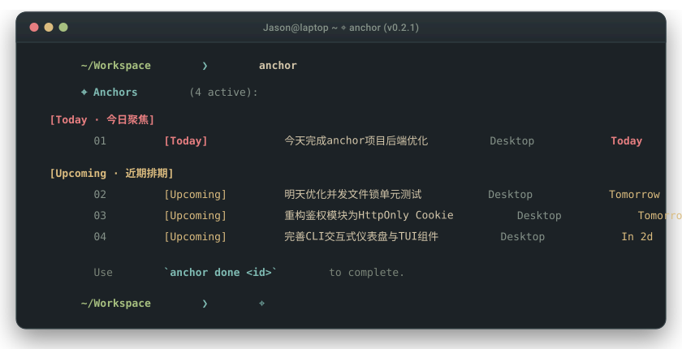

# ⌖ Anchor

面向 AI 编程智能体的零污染、0 闲置 Token 跨会话任务记忆系统。

告别发霉的 TODO.md。零 Git 历史污染，0 闲置 Token 损耗，代码提交自动核销结算。

[](https://github.com/3ZEROS12/anchor/actions/workflows/ci.yml)
[](package.json)
[](tsconfig.json)
[](tests/index.test.ts)
[](#1-绝对零仓库污染与跨进程文件锁)
[](LICENSE)

[English](./README.md) | **简体中文**

<p align="center">
  
</p>

```text
⌖ Anchors (4 active):

  [Today · 今日聚焦]
  01  [Today]     今天完成anchor项目后端优化         Desktop     Today         Today 10:02

  [Upcoming · 近期排期]
  02  [Upcoming]  明天优化并发文件锁单元测试         Desktop     Tomorrow      Yesterday 21:34
  03  [Upcoming]  重构鉴权模块为HttpOnly Cookie      Desktop     Tomorrow      Today 10:02
  04  [Upcoming]  完善CLI交互式仪表盘与TUI组件       Desktop     In 2d         Today 10:02

  Use `anchor done <id>` to complete.
```

## 一键安装

### Pi Coding Agent 扩展
在 Pi 终端内直接运行：

```bash
pi install npm:pi-anchor
```

### 全局系统 CLI
在任意 Bash、Zsh 或 PowerShell 中使用：

```bash
npm install -g pi-anchor
# 或无需安装直接试用
npx pi-anchor
```

---

## 核心价值：为什么需要 Anchor？

使用终端编程智能体（Claude Code、Pi、Aider 等）时，开发者每天都会遇到三个具体痛点：

### 1. 终端一关即失忆（Session Amnesia）
按下 `Ctrl+C` 退出终端，Agent 内存中的上下文被彻底清空。未完成的重构计划、临时交代的排期与多步约定瞬间丢失。

### 2. TODO.md 污染 Git 且拖垮上下文
在工程根目录下维护 `TODO.md` 或 `AGENTS.md`：
- 会产生大量 `update todo`、`fix checklist` 之类的 Git 杂质提交；
- **每一轮对话都要把几十行陈旧清单塞入 System Prompt**，白白消耗大量 Token 预算，还会分散模型对当前核心代码的注意力。

### 3. 告别手动打勾与清单发霉
写完代码后，工程师极少会专程打开 Markdown 逐个打勾。旧任务烂在仓库里，越积越多。
现有的第三方工具走向了重型极端（例如 `beads` 往代码库塞入 200MB 的 Dolt 数据库，`engram` 启动常驻后台的 Go 守护进程）。

**Anchor 选择了最克制、轻量的工程解法**：任务状态保存在全局主目录 `~/.anchor/`，工程代码库 100% 纯净；日常写代码轮次保持 0 Token 损耗，仅在触碰关联文件时精准唤醒；代码提交或退出终端时自动核销。

---

## 工作机制：行为-结果矩阵

```text
┌──────────────────────────────────────────────────────────────────────────────┐
│                        Anchor 核心生命周期状态机                             │
└──────────────────────────────────────┬───────────────────────────────────────┘
                                       │ 记录任务: anchor "重构鉴权为 HttpOnly Cookie"
                                       ▼
               ┌───────────────────────────────────────────────┐
               │           [活跃期 ACTIVE] (首轮注入提示)        │
               │ - 底部状态栏指示: ⌖ 4                          │
               │ - 第 2 轮起完全脱离提示词 (0 Token 稳态)        │
               └───────┬───────────────────────────────┬───────┘
                       │                               │
        Git 提交命中 /  │                               │ 闲置时间衰减
        触碰关联代码文件  ▼                               ▼
  ┌──────────────────────────────┐            ┌────────────────────────────────┐
  │   [多语言语法安全 JIT 唤醒]   │            │    [休眠期 SLEEPING] (0 Token) │
  │ 触碰代码时注入语言对应注释    │            │ 全局安全封存，不打扰当前心流，   │
  │ JSON/ENV 等格式绝对跳过      │            │ 触碰关联文件时重新唤醒          │
  └──────────────┬───────────────┘            └────────────────┬───────────────┘
                 │                                             │
        退出自动提议 / Commit 命中                             │ 静默定期清理
                 ▼                                             ▼
  ┌──────────────────────────────┐            ┌────────────────────────────────┐
  │     [已完成归档 SETTLED]      │            │     [超期淘汰 GRAVEYARD]       │
  │ 追加写入 archive.jsonl 归档   │            │ 超期自动清理，防止陈旧堆积       │
  │ 从当前活跃上下文中物理移除    │            │                                │
  └──────────────────────────────┘            └────────────────────────────────┘
```

| 动作 / 场景 | 你做什么 | Anchor 幕后动作 | AI 得到什么 | 适用场景 |
| :--- | :--- | :--- | :--- | :--- |
| **立项锚定** | 终端输入 `/pin "重构鉴权"` | 原子写入 `~/.anchor/state.json` | 首轮注入任务指引，第 2 轮起脱敏隐形（0 Token） | 跨会话记录多步计划与长效目标 |
| **代码触碰** | 正常阅读或修改代码 | 自动匹配关联文件后缀 | 注入对应语法的单行安全注释，绝不破坏代码 | Agent 触碰相关业务模块时 |
| **代码提交** | `git commit -m "feat: ..."` | 借助 `Intl.Segmenter` 分词匹配 | 自动核销任务并归档至 `archive.jsonl` | 完成开发里程碑，自动打勾 |
| **会话退出** | 输入 `exit` 或退出终端 | 扫描已改动文件与活跃任务的交集 | 弹出单键核销确认：`[Enter 归档] / [Esc 保留]` | 结束会话，零遗漏确认 |

---

## 核心特性与工程机制

- 🛡️ **绝对零仓库污染**：所有状态统一保存在用户主目录 `~/.anchor/`，被管项目内绝不创建任何 `.anchor` 目录，Git 提交历史 100% 纯净。
- ⚡ **0-Token 稳态经济**：第 1 轮冷启动注入任务，第 2 轮起从提示词中彻底隐形。正常写代码轮次消耗 **0 Token**，绝不稀释模型注意力。
- 🔒 **语法安全 JIT 唤醒**：根据文件后缀动态匹配合法注释（`//`, `#`, `<!-- -->`, `/* */`）。**对 JSON、ENV、Lockfile 坚决返回 null 严格跳过**，从根本上防止破坏格式解析器。
- ⚙️ **零依赖跨进程排他锁**：使用 Node 原生 `fs.openSync` 保证多终端并发读写安全。内置死锁自动熔断机制，若持有进程死亡或超时，自动安全回收重占。
- ⏳ **双时间轴管理**：同时跟踪交付排期（`targetDate`: Today, Tomorrow, Friday）与立项时效（`createdAt`: Today 10:02）。支持自然语言词汇自动折算为公历日期。
- 🧹 **静默衰减与墓地清理**：超期未触碰的任务自动转入休眠期，长期废弃任务自动移入 `graveyard.jsonl`，防止陈旧任务堆积。
- 🔌 **通用智能体协议解耦**：核心 `AnchorProtocol` 独立管理状态机，极薄适配层 `AgentAdapter` 可无缝接入 Pi、Claude Code、Cursor 或自定义 MCP 服务。

---

## 常用命令

### 命令行速查
```bash
anchor                                  # 查看活跃任务列表（Neovim 极客排版）
anchor "重构鉴权模块"                   # 快速立项新任务
anchor "提交实证报告" --due friday      # 指定周五到期
anchor done 1                           # 完成第 1 行任务（支持连续编号）
anchor done anc-5                       # 按具体 ID 完成任务
anchor undo                             # 撤销上一次完成归档
```

### Pi 扩展内交互命令
| 命令 | 说明 |
| :--- | :--- |
| `/pin "任务描述"` | 快速立项当前工程的跨会话任务 |
| `/anchor` | 在终端内弹出全景交互式任务仪表盘 |
| 状态栏 `⌖ N` | 底部常驻微标签，有活跃任务时显示数量，无任务时 100% 静默隐形 |

---

## 横向技术对比

| 核心维度 | `gastownhall/beads` | `Gentleman-Programming/engram` | `TODO.md` / `AGENTS.md` | **Anchor ⚓** |
| :--- | :--- | :--- | :--- | :--- |
| **存储架构** | 分布式 SQL 图数据库 | 向量检索 / SQLite | 本地静态 Markdown | **通用解耦协议 + 原子状态表** |
| **仓库卫生** | 往仓库塞入 200MB Dolt | 常驻 Go 守护进程 | **严重污染 Git 提交历史** | **100% 零仓库污染 (`~/.anchor/`)** |
| **Token 损耗** | 每轮中高开销 | 持续向量检索高消耗 | **严重累积（陈旧清单堆叠）** | **0 Token 稳态（仅关联代码触碰唤醒）** |
| **语法安全** | 不涉及 | 原始文本盲目注入 | 静态文本无感知 | **语法匹配，严格跳过 JSON/ENV** |
| **核销机制** | 手动敲命令关闭 | 被动存储不核销 | 手动改文件打勾 | **Git Commit 自动命中 + 退出一键归档** |
| **并发安全** | 数据库事务锁 | 单点通信瓶颈 | Git 合并冲突 | **零依赖跨进程排他锁 + 僵尸 PID 回收** |
| **启动耗时** | 重型 CLI 初始化 | 依赖后台常驻进程 | 无 | **< 90ms 预打包生产级产物** |
| **外部依赖** | 外部 Dolt 二进制 | 外部 Go 二进制 | 无 | **零原生二进制依赖（纯 TypeScript）** |

---

## 测试与质量验证

采用严苛 TypeScript Strict 模式，使用 Node 原生测试运行器实现 100% 真实断言覆盖：

```bash
npm run typecheck  # Strict tsc --noEmit 静态检查 (0 错误)
npm test           # 物理单元测试套件 (26/26 全部通过)
npm run build      # 双格式 ESM/CJS 构建与类型生成
```

---

## 开源协议

MIT © [Jason Song](https://github.com/3ZEROS12)
